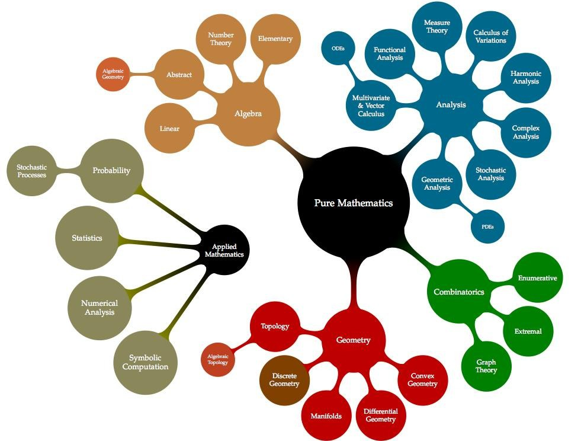
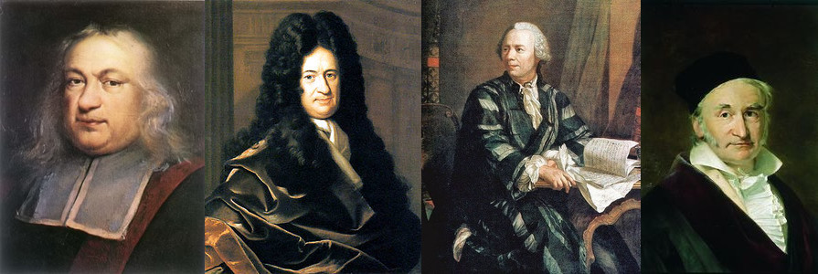
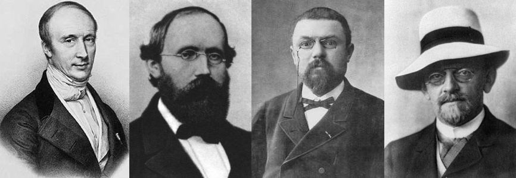
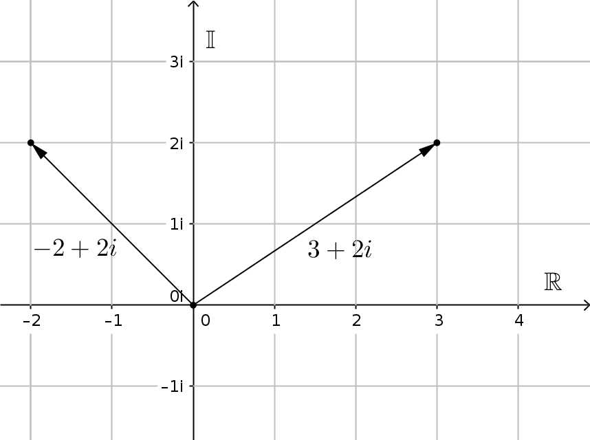
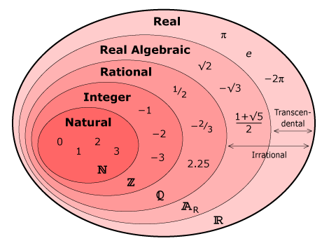
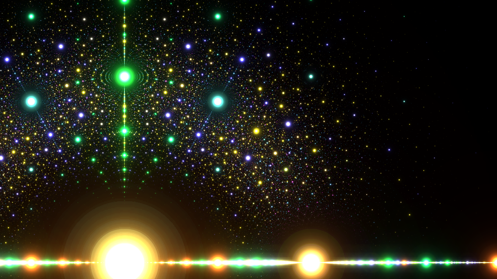

class: center, middle

### HY / Avoin yliopisto
# Matematiikkaa kaikille
### Kesä 2017

---
class: center, middle
## Osa 1: Mitä matematiikka on?

???
  * fysiikka: ainetta, energiaa ja peruslakeja tutkiva tiede
  * biologia: elollisen luonnon ilmiöitä ja lainalaisuuksia tutkiva luonnontiede
  * mitä tulee mieleen sanasta matematiikka?
  * laskento - yhtälönratkaisu - kuvaajat ja kuviot - geometria, tasokuviot, avaruuskappaleet - symmetriat - optimointi - päättely - symbolit
---
class: center, middle
### Luonnehdinta

  > Matematiikka on deduktiiviseen päättelyyn perustuva formaali eli käsitteellinen tiede.
  > Matematiikkaa käytetään [..] kielenä, jonka kielioppi ja käsitteistö on määritelty äärimmäisen tarkkaan.
  > Matematiikka ei tutki ympäröivää, fysikaalista todellisuutta, vaan käsitteellisiä riippuvuussuhteita.
  >.src[Wikipedia]

???

Ominaispiirteitä

- Eksaktisuus
- Abstraktisuus
- Käsitteellisyys ja symblismi
- Riippumattomuus
- Deduktiivisuus => pysyvyys ja luotettavuus: monet tulokset voimassa jo tuhansia vuosia
- Hyödynnettävyys => yhtäältä tiede ja toisaalta kieli, jota muut tieteet käyttävät

---
class: center, middle
### Matematiikka tieteenalana

* Pitkä historia, kulta-aika 1600-luvulta 1900-luvulle
* Tutkimus aktiivista, kokonaisuus valtavan laaja
* Tutkimuksessa keskitytään hyvin spesifeihin osa-alueisiin
* Periaatteessa riippumaton muista tieteistä
* Käytännössä vuorovaikutusta molempiin suuntiin
---
class: center, middle
### Matematiikan jaottelua

???
* muitakin jaotteluja: koulu-, yliopisto- ja kilpailumatematiikka
* algebra
* analyysi
* geometria
* joukko-oppi
* logiikka
* lukuteoria
* topologia
* todennäköisyys

- MSC-luokituksessa tuhansia tutkimusaloja: http://ams.org/msc

---
class: center, middle
### Muutamia merkkihenkilöitä

???

* Fermat 1607, lakimies ja matemaatikko, differentiaalilaskentaa, lukuteoriaa, analyyttistä geometriaa
* Leibniz 1646, filosofi ja matemaatikko, newtonin aikalainen, differentiaalilaskenta (mm. analyysin peruslause)
* Euler 1707, matemaatikko yms, differentiaalilaskenta, verkot, lukuteoria,... merkinnät e ja f(x)
* Gauss 1777, vaikutusvaltaisimpia matemaatikoita: lukuteoria, algebra, tilastotiede, analyysi, ...
* Cauchy 1789, matemaatikko, käytännössä loi kompleksianalyysin, nimeään kantavia tuloksia valtavasti
* Riemann 1826, matemaatikko, analyysi, lukuteoria, diff. geometria. Riemannin intergraali, Riemannin pinnat, Riemannin hypoteesi
* Poincare 1854, viimeinen universalisti, POincaren konjektuuri, kolmen kappaleen ongelma
* Hilbert 1862, yksi vaikutusvaltaisimpia, kontribuutioita nkykymatematiikan formalismiin, 23 kohdan ohjelma
---
class: center, middle
## Osa 2: Matemaattinen työskentely

> It has become customary to view mathematical research as establishing truth by rigorous deduction from appropriately chosen axioms and definitions.
> .src[Wikipedia]

???
* yksinkertaisista olettamuksista johdetaan uusia teoreemoja
* deduktiivisuus takaa, että teoreemat pitävät paikkansa oletusten vallitessa
* teoreemojen pohjalta johdetaan taas uusia tuloksia

---
class: center, middle
### Esimerkki: luonnolliset luvut
???
- Mitä luonnolliset luvut ovat?
- Miten ne voitaisiin määritellä?
- Miksi ne täytyy määritellä?
  - joidenkin mielestä ei tarvitse sillä ovat ymmärrykseemme sisäänrakennettuja
  - Kronecker: jumala loi luvut
  - toisten mielestä luvut eivät ole luonnollisia vaan seuraavat määritelmistä
---
### Esimerkki: luonnolliset luvut
#### Aksiomaattinen lähestymistapa (Peanon aksioomat)

Luonnollisten lukujen kaikki ominaisuudet saadaan johdettua seuraavista perusolettamuksista:

1. On olemassa luonnollinen luku 0.
2. Jokaisella luonnollisella luvulla on seuraaja, joka on luonnollinen luku.
3. 0 ei ole minkään luonnollisen luvun seuraaja.
4. Jos kahden luvun seuraajat ovat samat, niin luvut ovat samat.
5. Jos väite on tosi luvulla 0, ja siitä, että väite on tosi jollain luvulla seuraa, että se on tosi myös luvun seuraajalla, niin väite on tosi kaikilla luonnollisilla luvuilla.

Viimeistä aksioomaa kutsutaan *induktioperiaatteeksi*.
---

### Esimerkki: luonnolliset luvut
#### Konstruktivistinen lähestymistapa
Sovitaan, että
1. $0$ tarkoittaa tyhjää joukkoa, eli $0 = \\{\\}$.
2. $n$ tarkoittaa joukkoa $\\{0, 1, \\ldots, n-1\\}$.

Luonnolliset luvut rakentuvat tällöin seuraavasti:
- $0 = \\{\\}$
- \\(1 = \\{0\\} = \\{ \\{ \\} \\} \\)
- \\(2 = \\{0, 1\\} = \\{\\{\\}, \\{\\{\\}\\}\\} \\)
- \\(3 = \\{0, 1, 2\\} = \\{\\{\\}, \\{\\{\\}\\}, \\{\\{\\}, \\{\\{\\}\\}\\}\\} \\)
- \\(k = \\{0, 1, 2, \\ldots, k-1\\}\\)

Luku on siis sitä edeltävien - pienempien - lukujen kokoelma.

---
### Esimerkki: luonnolliset luvut
#### Yhteenlasku

Edellisessä tilanteessa luvun $n$ seuraaja $S(n)$ on siis $\\{0, 1, \\ldots, n\\}$.
Luonnollisten lukujen yhteenlasku saadaan määriteltyä asettamalla

1. $n + 0 = n$
2. $n + S(m) = S(n+m)$.

Jos vielä merkitään $S(0) = 1$, niin
$$
  n+1 = n + S(0) = S(n+0) = S(n),
$$
kuten pitääkin.
Lisäksi määritelmän jälkimmäinen ehto saa nyt tutun muodon:
$$
n + (m + 1) = (n + m) + 1.
$$

---
### Esimerkki: luonnolliset luvut
#### Kertolasku

Luonnollisten lukujen kertolasku saadaan puolestaan määriteltyä seuraavasti:

1. $n \cdot 0 = 0$
2. $n \cdot S(m) = n \cdot m + n$.

Merkinnän $S(m) = m + 1$ avulla jälkimmäinen ehto voidaan kirjoittaa tutussa muodossa:
$$
  n \cdot (m + 1) = n\cdot m + n
$$
Induktioperiaatteen avulla voitaisiin nyt näyttää esimerkiksi, että
$$
  a \cdot (b + c) = a\cdot b + a\cdot c
$$
kaikilla luonnollisilla luvuilla $a$, $b$ ja $c$.
---
class: center, middle
### Esimerkki: alkuluvut
---
### Esimerkki: alkuluvut
#### Määritelmä
  > Luonnollinen luku $n > 1$ on *alkuluku*, jos se on jaollinen vain itsellään ja luvulla $1$.
  > Muut luonnolliset luvut ovat *yhdistettyjä lukuja*.

- Alkulukujen jono alkaa seuraavasti: $$2, 3, 5, 7, 11, 13, 17, \ldots, 179, 181, 191, \ldots, 2011, 2017, \ldots $$

- Alkuluvut ovat tietyssä mielessä luonnollisten lukujen "rakennuspalikoita".

- Luvun alkutekijöiden löytäminen mielivaltaisessa tapauksessa on vaativaa ja käytännössä mahdotonta.

???
Aritmetiikan peruslauseessa kaksi osaa. Todistus induktiolla käyttäen Eukleideen lemmaa: p | ab => p | a V p | b
* äärettömästi
  * riemannin hypoteesi
  * n/ln(n)
* yhteys salauksiin
---
### Esimerkki: alkuluvut
#### Tärkeitä perusominaisuuksia
Eukleideen lause:
  > Alkulukuja on äärettömästi.

Aritmetiikan peruslause:
  > Jokainen luonnollinen luku voidaan esittää yksikäsitteisellä tavalla alkulukujen tulona.  

---
### Esimerkki: alkuluvut
#### Avoimia kysymyksiä
- Onko jokainen parillinen luku kahden alkuluvun summa? (Goldbach 1742)
- ~~Onko jokainen pariton luku summa kolmesta alkuluvusta?~~ (Golbachin heikko konjektuuri, todistettu 2013)
- Onko jokaiselle parilliselle luvulle $n$ olemassa äärettömän monta
  peräkkäisten alkulukujen paria, joiden etäisyys on $n$? (Polignac 1849)
- Onko kaksoisalkulukuja (*twin primes*) äärettömästi?
- Onko lukujen $n^2$ ja $(n+1)^2$ välillä aina alkuluku? (Opperman 1882)
- Onko Mersennen alkulukuja äärettömästi?

???
- Goldbach: esim 10 = 7 + 3 ja 24 = 11 + 13
- Goldbach odd: esim. 17 = 3 + 7 + 7 ja 25 = 3 + 11 + 11
* Mersennen luvut ovat muotoa $2^n-1$ olevia alkulukuja. Niitä tunnetaan 49. Suurimmassa on yli 22 miljonaa numeroa.
* Mersennen lukujen yhteys salauksiin?
---
class: center, middle
### Esimerkki: lukujoukot
---

### Esimerkki: lukujoukot
#### Luonnollisista luvuista kompleksilukuihin
* Kokonaislukujen joukko $\\mathbb{Z}$ saadaan laajentamalla luonnollisten lukujen joukkoa muotoa
$$
  a + x = 0, a\\in\\mathbb{N}
$$
olevien yhtälöiden ratkaisuilla.

* Rationaalilukujen joukko $\\mathbb{Q}$ saadaan laajentamalla kokonaislukujen joukkoa muotoa
$$
ax = 1, a\\in\\mathbb{Z}
$$
olevien yhtälöiden ratkaisuilla.

* Reaalilukujen joukko $\\mathbb{R}$ saadaan laajentamalla rationaalilukujen joukkoa ns. irrationaaliluvuilla.
  Irrationaalilukuja on *enemmän* kuin rationaalilukuja.
---

### Esimerkki: lukujoukot
#### Luonnollisista luvuista kompleksilukuihin
* Kompleksilukujen joukko $\\mathbb{C}$ saadaan laajentamalla reaalilukujen joukkoa imaginaariyksiköllä $i$.
* Kompleksilukujen joukko on viimein *algebrallisesti suljettu*: $n$-asteisella polynomilla on aina $n$ juurta.
.wrapper[]
.caption[Kompleksiluvut muodostavat lukutason]

---
### Esimerkki: lukujoukot

---

### Esimerkki: lukujoukot
#### Algebralliset luvut

* Algebrallisiksi luvuiksi kutsutaan niitä kompleksilukuja, jotka saadaan muotoa
$$
a_0 + a_1x + a_2x^2 + \\ldots + a_nx^n = 0
$$
olevien yhtälöiden ratkaisuina, missä luvut $a_i$ ovat rationaalilukuja.

* Loput reaali- ja kompleksiluvut ovat transendenttilukuja. Niitä ei voi esittää minkään rationaalikertoimisen polynomiyhtälön ratkaisuna. Esimerkiksi luvut $\\pi$ ja Neperin luku $e$ ovat transendenttilukuja.

???
Luvun $\\pi$ transendenttisuus takaa, että ympyrän neliöinti on mahdoton tehtävä
kumpaan suuntaan hyvänsä. Jos neliöinti olisi mahdollista, niin $\\pi$ olisi
`a constructable number` ja sellaisena myös algebrallinen.

Esimerkiksi $\\sqrt[3]{2}$ on algebrallinen, ei-konstruoitava luku. Tämän vuoksi
kuution kahdentaminen harpin ja viivaimen avulla on mahdoton tehtävä.

Lindemannin-Weierstrassin lauseen avulla luvun transendenttisuus on joskus
helppo osoittaa. Esimerkiksi, jos $a \\neq 0$ on mikä hyvänsä algebrallinen luku,
niin $\\sin a$, $\\cos a$ ja $\\tan a$ ovat transendenttisia. Nämä ovatkin nk.
trasendenttifunktioita.
---
### Esimerkki: lukujoukot
#### Algebralliset luvut

.caption[Algebrallisia lukuja kompleksitasossa.]
---
### Esimerkki: geometria
#### Aksioomat

1. Mitkä tahansa kaksi pistettä voidaan yhdistää suoralla.
2. Mikä tahansa jana voidaan jatkaa äärettömäksi.
3. Mille tahansa janalle voidaan piirtää ympyrä siten, että jana on ympyrän säde ja janan toinen päätepiste on ympyrän keskipiste.
4. Kaikki suorat kulmat ovat yhtä suuria.
5. Suoran ulkopuolella olevan pisteen kautta voidaan piirtää tarkalleen yksi suora, joka ei leikkaa alkuperäistä suoraa.
