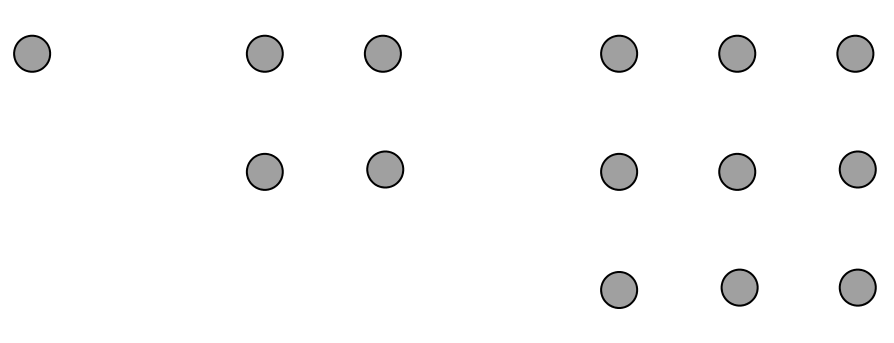

::: title
- HY / Avoin yliopisto
- Matematiikan ja tilastotieteen laitos
- Matematiikkaa kaikille (kesä 2017)
- Harjoitus 1
:::

::: teht
# Tehtävä
* Valitse mikä tahansa kolminumeroinen luku.
* Muodosta kuusinumeroinen luku toistamalla valitsemasi luvun numerot.
* Jaa kuusinumeroinen lukusi 13:lla. Meneekö jako tasan?
* Jaa tulos edelleen 11:lla. Meneekö jako tasan?
* Jaa tulos edelleen 7:lla. Meneekö jako tasan?
* Vertaa tulosta alkuperäiseen kolminumeroiseen lukuun. Mitä huomaat?
* Osaatko perustella havaintosi pätevän yleisesti?
:::
::: ratk
# Ratkaisuehdotus
Jako menee tasan ja tulos on alkuperäinen luku. Tämä johtuu siitä, että
kolminumeroisen luvun toistaminen vastaa sen kertomista
luvulla $1001 = 13\cdot 11 \cdot 7$ ja toisin päin: esimerkiksi $314\cdot1001 = 314314$.
:::

::: teht
# Tehtävä
Luonnollinen luku $n$ on *kolmioluku*, jos $n$ pistettä voidaan asetella kolmion muotoon. Esimerkiksi $1$, $3$ ja $6$ ovat kolmiolukuja:

  

* Selvitä viisi ensimmäistä kolmiolukua.
* Miten kolmioluku saadaan edellisestä kolmioluvusta?
* Millainen summalauseke kertoo $n$:nnen kolmioluvun?
* Perustele kolmiolukujen avulla, että $1 + 2 + 3 + \ldots + n = n(n+1)/2$.
:::
::: ratk
# Ratkaisuehdotus

* Viisi ensimmäistä kolmiolukua ovat $1, 3, 6, 10, 15$
* Järjestyksessä $n$:s kolmioluku saadaan edellisestä lisäämällä $n$ (pistettä).
* Järjestyksessä $n$:s kolmioluku - pisteiden lukumäärä kuviossa - saadaan summana $1 + 2 + 3 + \ldots + n$.
* Piirretään $n\times(n+1)$-kokoinen suorakulmio ja jaetaan se kahtia lävistäjän avulla.
  Syntyy kaksi samankokoista kolmiota, jotka vastaavat $n$:siä
  kolmiolukuja. Kummankin "pinta-ala" on $1 + 2 + 3 + \ldots + n$. Väite seuraa.
:::
::: teht
# Tehtävä
Luonnollinen luku on *neliöluku*, jos $n$ pistettä voidaan asetella neliön muotoon. Esimerkiksi $1$, $4$ ja $9$ ovat neliölukuja:

  

* Selvitä viisi ensimmäistä neliölukua.
* Miten neliöluku saadaan edellisestä neliöluvusta?
* Perustele neliölukujen avulla, että $1 + 3 + 5 +\ldots + (2n - 1) = n^2$.
* Miten neliöluku voidaan muodostaa kolmiolukujen avulla?
:::
::: ratk
# Ratkaisuehdotus
* Viisi ensimmäistä neliölukua ovat $1, 4, 9, 16, 25$.
* Seuraava neliöluku saadaan lisäämällä toiselle sivulle $n+1$ pistettä ja toiselle $n$, eli yhteensä $2n+1$ pistettä.
* Edellisen perusteella $n$:s neliöluku on $1 + 3 + 5 +\ldots + (2n - 1)$. Toisaalta $n$:s neliöluku on $n^2$. Luvut ovat siis yhtäsuuret.  
* Neliöluku on kahden peräkkäisen kolmioluvun summa.
:::
::: teht
# Tehtävä
Luonnollinen luku on *kuutioluku*, jos $n$ pistettä voidaan asetella kuution muotoon. Esimerkiksi $1$, $8$ ja $27$ ovat kuutiolukuja.

* Laske aiemmassa tehtävässä selvittämiesi kolmiolukujen neliöt (toiset potenssit).
* Laske peräkkäisten neliöiden erotukset. Mitä huomaat?
* Miten voisit ilmentää havaintoasi esimerkiksi kolmiolukujen $6$ ja $10$ tapauksessa?
* Mitä voit havaintosi perusteella sanoa luvusta $1^3 + 2^3 + 3^3 + 4^3 + 5^3$?
* Bonus: Selvitä, päteekö havaintosi yleisesti!
:::
::: ratk
# Ratkaisuehdotus

* $1^2=1$, $3^2=9$, $6^2=36$, $10^2=100$, $15^2=225$
* Erotukset ovat $8, 27, 64, 125$. Ne ovat peräkkäisiä kuutiolukuja.
*
* Havainnon perusteella kuutioluvut voidaan kirjoittaa neliöiden erotuksena:
  $$
    1^3 + 2^3 + 3^3 + 4^3 + 5^3 = 1^2 + (3^2 - 1^2) + (6^2 - 3^2) + (10^2 - 6^2) + (15^2 - 10^2).
  $$
  Oikean puolen lausekkeessa summattavat kumoutuvat säännöllisesti ja jäljelle jää ainoastaan $15^2$.
  Kun vielä muistetaan, että $15$ on $5$. kolmioluku, saadaan yhtälö
  $$
    1^3 + 2^3 + 3^3 + 4^3 + 5^3 = (1 + 2 + 3 + 4 + 5)^2.
  $$
* Havainto pätee yleisesti, eli kaikilla $n\in\mathbb{N}_+$ pätee
  $$
    1^3 + 2^3 + 3^3 + \ldots + n^3 = (1 + 2 + 3 + \ldots + n)^2.
  $$
  Katso [kuva](https://upload.wikimedia.org/wikipedia/commons/thumb/2/26/Nicomachus_theorem_3D.svg/512px-Nicomachus_theorem_3D.svg.png)
  ja [lue lisää](https://en.wikipedia.org/wiki/Cube_(algebra)#Sum_of_first_n_cubes).
:::

::: teht
# Tehtävä
Kuuluisa *Fibonaccin lukujono* määritellään asettamalla $a_1=1$, $a_2=1$ ja $a_{n+2} = a_{n} + a_{n+1}$. Jono alkaa $1, 1, 2, 3, 5, 8, 13, \ldots$.
Lukujonoa sanotaan joskus *fibonaccimaiseksi*, jos se muodostetaan kuten Fibonaccin jono, mutta mielivaltaisilla aloitusluvuilla.

* Valitse kaksi (pientä) luonnollista lukua $a_1$ ja $a_2$ fibonaccimaisen jonon ensimmäisiksi jäseniksi.
* Selvitä jonosi 10 ensimmäistä jäsentä yksi kerrallaan. Esimerkiksi kolmas jäsen saadaan kaavalla $a_3 = a_1 + a_2$.
* Laske 10 ensimmäisen jäsenen summa ja jaa se jonosi 7. jäsenellä.
* Vertaa tulosta toisten ryhmäläisten tuloksiin. Mitä huomaat?
* Osaatko perustella havaintosi pätevän yleisesti? Voisiko tulosta yleistää?
:::
::: ratk
# Ratkaisuehdotus
* $a_1=2$, $a_2=5$
* $2, 5, 7, 12, 19, 31, 50, 81, 131, 212$
* Summa on $550$, 7. jäsen $50$, osamäärä $11$
* Tulos on sama kaikilla muillakin jonoilla
*
:::

::: teht
# Tehtävä
*Collatzin jono* muodostetaan aloittamalla mielivaltaisesta luonnollisesta luvusta ja käyttämällä toistuvasti kaavaa
$$
  a_{n+1} =
  \begin{cases}
    a_n / 2, \text{ kun } a_n \text{ on parillinen }\\
    3a_n + 1, \text{ kun } a_n \text{ on pariton}
  \end{cases}
$$
*Collatzin konjektuuri* sanoo, että prosessi johtaa lukuun 1 äärellisellä määrällä askelia riippumatta aloitusluvusta. Väitettä ei ole onnistuttu todistamaan, mutta se on tarkistettu valtavan suurelle joukolle lukuja. Joidenkin mielestä näyttää siltä, että vaikka väite olisi totta, niin sen todistaminen on nykymatematiikan ulottumattomissa.

Tee toinen tai molemmat seuraavista tehtävistä:

* Valitse kolme lukua väliltä 1 - 20 ja muodosta Collatzin jonot. Kuinka monta askelta tarvitset päästäksesi lukuun 1?
* Kirjoita ohjelma, joka tulostaa Collatzin jonon annetulle luvulle väliltä 1 - 100. Voit käyttää valitsemaasi ohjelmointikieltä, myös pseudokoodia. Tutki ohjelmasi toimintaa muutamilla luvuilla.
:::
::: ratk
# Ratkaisuehdotus
Jos valitaan esim. luvut $5, 7, 12$, niin saadaan seuraavat jonot:
$$ 5, 16, 8, 4, 2, 1 $$
$$ 7, 22, 11, 34, 17, 52, 26, 13, 40, 20, 10, 5, 16, 8, 4, 2, 1$$
$$ 12, 6, 3, 10, 5, 16, 8, 4, 2, 1 $$
:::

::: note
Jokainen luonnollinen luku voidaan jakaa yksikäsitteisellä tavalla alkulukujen tuloksi eli *alkutekijöihin*.

Esimerkiksi luvun $60$ esitys alkutekijöidensä tulona on $60 = 2^2\cdot3\cdot5$ ja luvun $28$ vastaavasti $28=2^2\cdot7$.

Ottamalla luvun alkutekijöiden kaikki mahdolliset yhdistelmät, löydetään kaikki luvun *tekijät* eli *jakajat*.
Muut jakajat kuin luku itse ovat sen *aitoja jakajia*. Tilanteesta riippuen luku $1$ saatetaan jättää jakajista pois.
Esimerkiksi luvun $60$ jakajat ovat luvut
$$
1, 2, 3, 5, 4, 6, 10, 15, 12, 20, 30, 60.
$$
:::

::: teht
# Tehtävä
Jaa seuraavat luvut a) alkutekijöihin b) tekijöihin:

$$
4, 6, 12, 18, 28, 30, 40, 70
$$

Voit laskea päässäsi tai käyttää apuvälineitä (välivaiheita ei tarvitse kirjoittaa näkyviin).
:::
::: ratk
# Ratkaisuehdotus
| Luku | Alkutekijät | Tekijät             |
|------|-------------|---------------------|
| 4    | 2,2         | 1,2,4               |
| 6    | 2,3         | 1,2,3,6             |
| 12   | 2,2,3       | 1,2,3,4,6,12        |
| 18   | 2,3,3       | 1,2,3,6,9,18        |
| 28   | 2,2,7       | 1,2,4,7,14,28       |
| 30   | 2,3,5       | 1,2,3,5,6,10,15,30  |
| 40   | 2,2,2,5     | 1,2,4,8,10,20,40    |
| 70   | 2,5,7       | 1,2,5,7,10,14,35,70 |
:::

::: teht
# Tehtävä
Luonnollisia lukuja voidaan ryhmitellä monella tavalla niiden ominaisuuksien mukaan.
Esimerkiksi sanotaan, että luku on

1. *täydellinen*, jos se on kaikkien tekijöidensä summa.
2. *puolitäydellinen*, jos se on joidenkin tekijöidensä summa.
3. *outo*, jos se on pienempi kuin kaikkien tekijöidensä summa, muttei puolitäydellinen.
4. *vajaa*, jos se on suurempi kuin tekijöidensä summa.

Tässä lukua ei lasketa itsensä tekijäksi, mutta $1$ lasketaan. Nämä luokat eivät kata kaikkia luonnollisia lukuja.

Tutki edellisen tehtävän avulla, ovatko seuraavat luvut täydellisiä, puolitäydellisiä tai outoja:
$$
4, 6, 12, 18, 28, 30, 40, 70
$$
:::
::: ratk
# Ratkaisuehdotus
| Luku | Alkutekijät | Tekijät          | Tekijöiden summa | Tyyppi           |
|------|-------------|------------------|------------------|------------------|
| 4    | 2,2         | 1,2              | 3                | Vajaa            |
| 6    | 2,3         | 1,2,3            | 6                | Täydellinen      |
| 12   | 2,2,3       | 1,2,3,4,6        | 16               | Puolitäydellinen |
| 18   | 2,3,3       | 1,2,3,6,9        | 21               | Puolitäydellinen |
| 28   | 2,2,7       | 1,2,4,7,14       | 28               | Täydellinen      |
| 30   | 2,3,5       | 1,2,3,5,6,10,15  | 42               | Puolitäydellinen |
| 40   | 2,2,2,5     | 1,2,4,8,10,20    | 45               | Puolitäydellinen |
| 70   | 2,5,7       | 1,2,5,7,10,14,35 | 74               | Outo             |
:::

::: teht
# Tehtävä
Luvut $m$ ja $n$ ovat suhteellisia alkulukuja, jos niiden suurin yhteinen tekijä on 1. Esimerkiksi luvut $6$ ja $25$ ovat suhteellisia alkulukuja, mutta $6$ ja $24$ eivät ole.

*Eulerin funktio* $\varphi\colon\mathbb{N}\to\mathbb{N}$ määritellään siten, että $\varphi(n)$ on sellaisten luvun $n$ suhteellisten alkulukujen määrä, jotka ovat pienempiä kuin $n$. Esimerkiksi $\varphi(6) = 2$ ja $\varphi(8) = 4$.

* Määritä $\varphi(12)$, $\varphi(30)$ ja $\varphi(70)$ esimerkiksi etsimällä lukujen alkutekijät ja käyttämällä Erastotheneen seulaa.
* Mitä voit sanoa luvusta $\varphi(n)$, kun $n$ on alkuluku?
* Jos $m$ ja $n$ ovat suhteellisia alkulukuja, niin $\varphi(mn) = \varphi(m)\varphi(n)$. Määritä tämän tiedon avulla luvut $\varphi(77)$ ja $\varphi(99)$.
* Jos $p$ on alkuluku, niin $\varphi(p^k) = p^k\left(1-\frac{1}{p}\right)$. Määritä tämän tiedon avulla luvut $\varphi(128)$ ja $\varphi(625)$.
:::
::: ratk
# Ratkaisuehdotus
* $\varphi(12) = 4$, $\varphi(30) = 8$ ja $\varphi(70) = 24$
* Alkuluvun tapauksessa $\varphi(n) = n-1$
* $\varphi(77) = \varphi(7\cdot 11) = 6\cdot 10 = 60$ ja $\varphi(99) = \varphi(9\cdot11) = 2\cdot 2\cdot 10 = 40$
* $\varphi(128) = \varphi(2^7) = 2^7(1-1/2) = 64$ ja $\varphi(625) = \varphi(5^4) = 5^4(1-1/5) = 500$.
:::

::: teht
# Tehtävä
Gauss osoitti, että jokainen luonnollinen luku $n$ voidaan esittää tekijöidensä $d$ avulla summana Eulerin funktion arvoista $\varphi(d)$.
Lyhyesti sanottuna siis kaikilla $n\in\mathbb{N}$ pätee
$$
  \sum_{d\mid n}\varphi(d) = n.
$$
Tarkista Gaussin väite lukujen $18$, $28$ ja $70$ osalta. Voit käyttää apuna alta löytyvää taulukkoa.

| +   | 0   | 1   | 2   | 3   | 4   | 5   | 6   | 7   | 8   | 9   |
|-----|-----|-----|-----|-----|-----|-----|-----|-----|-----|-----|
| 0   |     | 1   | 1   | 2   | 2   | 4   | 2   | 6   | 4   | 6   |
| 10  | 4   | 10  | 4   | 12  | 6   | 8   | 8   | 16  | 6   | 18  |
| 20  | 8   | 12  | 10  | 22  | 8   | 20  | 12  | 18  | 12  | 28  |
| 30  | 8   | 30  | 16  | 20  | 16  | 24  | 12  | 36  | 18  | 24  |
| 40  | 16  | 40  | 12  | 42  | 20  | 24  | 22  | 46  | 16  | 42  |
| 50  | 20  | 32  | 24  | 52  | 18  | 40  | 24  | 36  | 28  | 58  |
| 60  | 16  | 60  | 30  | 36  | 32  | 48  | 20  | 66  | 32  | 44  |
| 70  | 24  | 70  | 24  | 72  | 36  | 40  | 36  | 60  | 24  | 78  |
| 80  | 32  | 54  | 40  | 82  | 24  | 64  | 42  | 56  | 40  | 88  |
| 90  | 24  | 72  | 44  | 60  | 46  | 72  | 32  | 96  | 42  | 60  |
:::
::: ratk
# Ratkaisuehdotus
Käytetään aiemman tehtävän ratkaisua ja tehtävässä annettua taulukkoa:
$$
  \sum_{d\mid 18}\varphi(d) = \varphi(1) + \varphi(2) + \varphi(3) + \varphi(6) + \varphi(9) + \varphi(18) = 1 + 1 + 2 + 2 + 6 + 6 = 18.
$$

$$
  \begin{aligned}
  \sum_{d\mid 28}\varphi(d) &= \varphi(1) + \varphi(2) + \varphi(4) + \varphi(7) + \varphi(14) + \varphi(28) \\
  &= 1 + 1 + 2 + 6 + 6 + 12 = 28
  \end{aligned}
$$

$$
  \begin{aligned}
  \sum_{d\mid 70}\varphi(d)
  &= \varphi(1) + \varphi(2) + \varphi(5) + \varphi(7) + \varphi(10) + \varphi(14) + \varphi(35) + \varphi(70) \\
  &= 1 + 1 + 4 + 6 + 4 + 6 + 24 + 24 = 70
  \end{aligned}
$$
:::

::: teht
# Tehtävä
Fermat'n pieni lause sanoo, että jos $p$ on alkuluku, niin luku $a^{p-1}-1$ on jaollinen luvulla $p$.
Tulkitse ja tarkista lauseen väite

* luvuilla $a=2$ ja $p=7$
* joillakin muilla luvuilla $a$ ja $p$.
:::
::: ratk
# Ratkaisuehdotus
* Jos  $a=2$ ja $p=7$, niin lauseen mukaan $2^{7-1}-1$ olisi jaollinen luvulla $p$.
  Tämä pätee, sillä $2^{7-1}-1 = 2^6 - 1 = 63 = 7\cdot 9$.
* Valitaan esim. $a = 4$ ja $p=5$, jolloin $4^{5-1}-1 = 4^4 - 1 = 255 = 5\cdot 51$.
:::

::: teht
# Tehtävä
Euler tarkensi Fermat'n tulosta osoittamalla, että jos luonnolliset luvut $a$ ja $n$ ovat suhteellisia alkulukuja, niin $a^{\varphi(n)}-1$ on jaollinen luvulla $n$.
Tulkitse ja tarkista lauseen väite

* luvuilla $a=9$ ja $n=4$
* joillakin muilla luvuilla $a$ ja $n$.

Miksi Fermat'n pieni lause seuraa Eulerin tuloksesta?
:::
::: ratk
# Ratkaisuehdotus
* $9^{\varphi(4)}-1 = 9^2 - 1 = 80 = 4\cdot 20$, joten $9^{\varphi(4)}-1$ on jaollinen luvulla $4$.
* Valitaan esim. $a = 6$ ja $n=12$, jolloin $6^{\varphi(12)}-1 = 6^4 - 1 = 1296 - 1 = 12\cdot 108$.

Fermat'n pieni lause seuraa, koska $\varphi(n) = n-1$ silloin, kun $n$ on alkuluku.
:::
