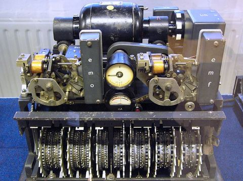
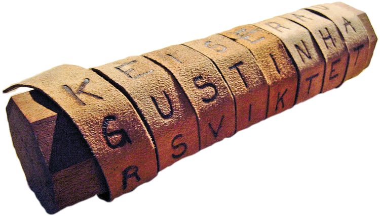
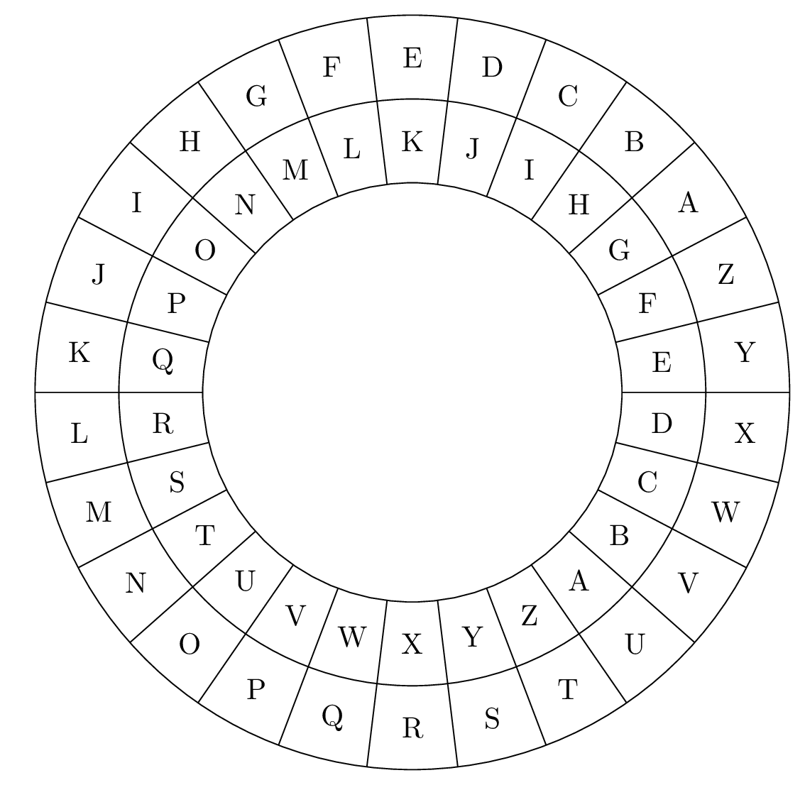
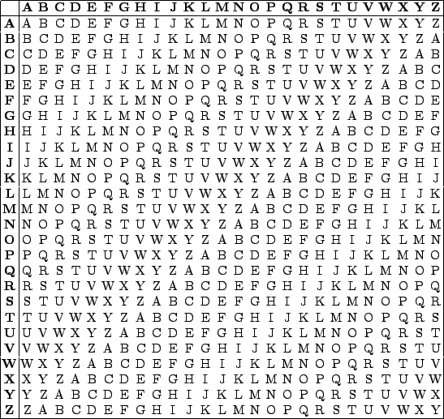
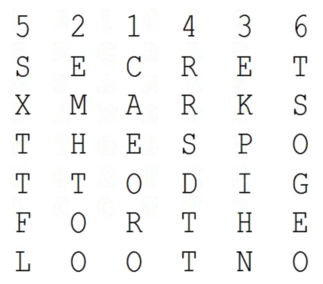
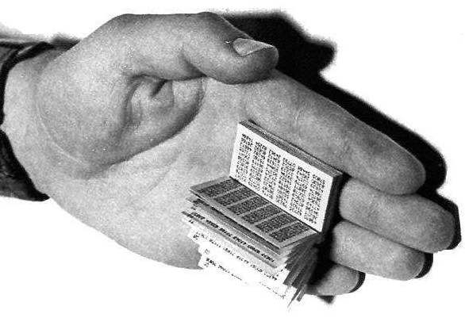
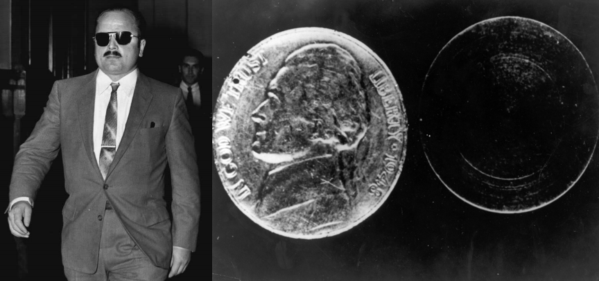
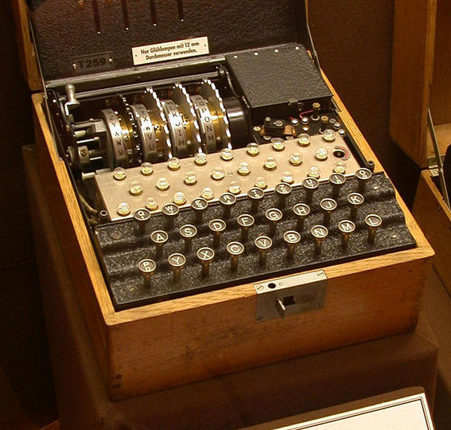
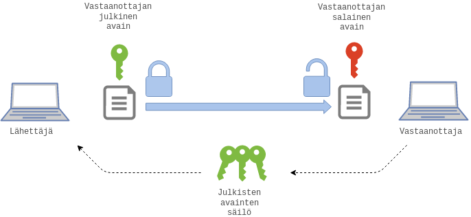

class: center, middle

# Matematiikkaa kaikille: Salakirjoitusmenetelmiä

---
## Perusidea
* Luottamuksellinen kommunikointi
* Steganografia: viestien kätkeminen
* Kryptografia: viestien salakirjoittaminen
* Perinteisesti tehty käsityönä, sittemmin mekaanisesti ja nykyisin tietokoneilla

.caption[Lorentzin laite, kuva: https://en.wikipedia.org/wiki/Lorenz_cipher]
???
* tarve luottamukselliseen kommunikointiin ollut kautta aikojen ja kulttuurien
* muinaiset roomalaiset, kreikkalaiset, intialaiset, arabit jne
* kätkeminen
* päänahka
* teksti
* pikselit
---
## Klassiset menetelmät: Scytale

.caption[Kuva: https://en.wikipedia.org/wiki/Scytale#/media/File:Skytale.png]

???
* "skitali"
* 2500 vuotta sitten
---
## Klassiset menetelmät: Atbash
#### Aakkosten peilaus
|A|B|C|D|E|F|G|H|I|J|K|L|M|N|O|P|Q|R|S|T|U|V|W|X|Y|Z|Ä|Ö|
|-|-|-|-|-|-|-|-|-|-|-|-|-|-|-|-|-|-|-|-|-|-|-|-|-|-|-|-|
|Ö|Ä|Z|Y|X|W|V|U|T|S|R|Q|P|O|N|M|L|K|J|I|H|G|F|E|D|C|B|A|

##### Matemaattisesti:

$$
E(x_i) = n - x_i \text{ mod } 26 \quad\text{ja}\quad D_n(x_i) = n + x_i \text{ mod } 26,
$$
missä $x_i$ on salattavan viestin $i$:nnen kirjaimen järjestysluku aakkostossa.
???
* Esim. `ATTACKATDAWN` => `ÖIIÖZRÖIYÖFO`
---
## Klassiset menetelmät: Caesar

.caption[Caesarin kiekko]
---
## Klassiset menetelmät: Caesar
#### Aakkosten siirto vakiolla
##### Caesar-1
|A|B|C|D|E|F|G|H|I|J|K|L|M|N|O|P|Q|R|S|T|U|V|W|X|Y|Z|Ä|Ö|
|-|-|-|-|-|-|-|-|-|-|-|-|-|-|-|-|-|-|-|-|-|-|-|-|-|-|-|-|
|B|C|D|E|F|G|H|I|J|K|L|M|N|O|P|Q|R|S|T|U|V|W|X|Y|Z|Ä|Ö|A|

##### Caesar-13
|A|B|C|D|E|F|G|H|I|J|K|L|M|N|O|P|Q|R|S|T|U|V|W|X|Y|Z|Ä|Ö|
|-|-|-|-|-|-|-|-|-|-|-|-|-|-|-|-|-|-|-|-|-|-|-|-|-|-|-|-|
|N|O|P|Q|R|S|T|U|V|W|X|Y|Z|Ä|Ö|A|B|C|D|E|F|G|H|I|J|K|L|M|

##### Matemaattisesti:

Caesar-$n$:
$$
E_n(x_i) = x_i + n \text{ mod } 26 \quad\text{ja}\quad D_n(x_i) = x_i - n \text{ mod } 26,
$$
missä $x_i$ on salattavan viestin $i$:nnen kirjaimen järjestysluku aakkostossa.

???
* Esim. `ATTACKATDAWN` => `NEENPXNEQNHÄ`
* Tyypillisesti ROT13 tai ROT47
---
## Klassiset menetelmät: Vigenère

.caption[Vigenèren neliö]
---
## Klassiset menetelmät: Vigenère
#### Aakkosten siirto avainsanan mukaan

##### Matemaattisesti:

Vigenère avaimella $k$:
$$
E_k(x_i) = x_i + k_i \text{ mod } 26 \quad\text{ja}\quad D(x_i) = x_i - k_i \text{ mod } 26,
$$
missä $x_i$ on salattavan viestin $i$:nnen kirjaimen järjestyluku ja vastaavasti
$k_i$ on $i$:nnen kirjaimen järjestyluku.

???
`ATTACKATDAWN + TUNNY = TNGNADUGQYPH`
Peräisin 1500-luvulta
Variaatioita:
  - Beaufort
  - Gronsfeld
---
## Klassiset menetelmät: Transpositiosalaus
#### Viestin permutointi

.caption[Transpositiosalaukseen käytettävä ruudukko]
.caption[Kuvan [lähde](http://1.bp.blogspot.com/_CpsuksxBcUg/TLCNxZa9c2I/AAAAAAAAAD0/dvMjAx-X87Q/s200/TranspositionCiphers2.JPG).]
---
## Klassiset menetelmät: yhteenveto
* Yleensä yksinkertaisia aakkoston muunnoksia
* Vanhimmat kaukaa historiasta
* Lähinnä viihdekäytössä
* Ei todellista salausvoimaa
* Johtivat frekvenssianalyysin keksimiseen
* Murrettavissa tietokoneilla sekunneissa

???
* frekvenssianalyysin löytämisen (keskiajalla) jälkeen klassinen salaus (caesarista enigmaan) menettänyt tehonsa
* Beaufort on kääntyvä eli salausoperaatio salatekstille tuottaa lähdetekstin
* Claude Shannon proved, using information theory considerations, that any theoretically unbreakable cipher must have keys which are at least as long as the plaintext, and used only once: one-time pad.
* https://en.wikipedia.org/wiki/Substitution_cipher
---
## Uudemmat menetelmät: Vernam

.caption[KGB:n käyttämiä kerta-avaimia]
.caption[Kuva: http://www.ranum.com/security/computer_security/papers/otp-faq/]

???
Claude Shannon todisti, että kerta-avaimella salaus ei paljasta mitään selkotekstistä,
jos avain on
* satunnainen
* pidetty salassa
* kertakäyttöinen
Sodan aikana Yhdysvallat saivat purettua saksalaisten systeemin, koska avaimet eivät olleet todellisuudessa satunnaisia
Samoin neuvostoliiton vakoojien viestejä saatiin purettua tuhansia (sadoista tuhansista), kun samoja avaimia oli käytetty
kiireessä useasti
---
## Uudemmat menetelmät: VIC

.caption[Reino Häyhänen ja ontto kolikko. Katso myös [salakirjoitus](https://upload.wikimedia.org/wikipedia/commons/2/24/Hollow_Nickel_Message.jpg).]
.caption[Kuvat: https://en.wikipedia.org/wiki/Reino_H%C3%A4yh%C3%A4nen ja https://en.wikipedia.org/wiki/Hollow_Nickel_Case]
???
- 1953 Brooklyn nuori lehdenmyyjä
- kevyt kolikko putoaa ja halkeaa, sisällä mikrofilmiä
- salausta ei saada purettua
- Neuvostovakooja Reino Häyhänen loikkaa 1957 paljastaa salauksen
- saa syytesuojan mutta kuolee onnettomuudessa 1961

Salauksesta tarkemmin:https://www.cia.gov/library/center-for-the-study-of-intelligence/kent-csi/vol5no4/html/v05i4a09p_0001.htm
---
## Uudemmat menetelmät: [Enigma](https://www.youtube.com/watch?v=G2_Q9FoD-oQ)

.caption[Kuva: https://en.wikipedia.org/wiki/Enigma_machine#/media/File:Four-rotor-enigma.jpg]
---

## Modernit menetelmät
* Automatisoituja
* Perustuvat matematiikkaan
* Luotettavia, vaikka jatkuva kilpajuoksu laskentatehoa vastaan
* Algoritmeja valtavasti eri tarkoituksia varten
* Käytetään esimerkiksi
  - salaukseen
  - allekirjoitamiseen
  - sisällön eheyden varmistamiseen
  - autentikointiin
* Digitaalinen viestintä, Internet, pankkimaailma, sotateknologia, tekijänoikeudet, ...
---
## Modernit menetelmät
#### Esimerkki: Secret sharing
* Shamir / Blakley (1979)
* Keino hajauttaa esimerkiksi salakirjoituksen avain
* Perustuu yleensä
  - polynomien ominaisuuksiin (Shamir)
  - lineaarialgebraan (Blakley)
  - kiinalaiseen jäännöslauseeseen (Mignotte)
* Käyttökohteita esimerkiksi
  - salausavaimet
  - teknologia
  - salaiset pankkitilit
  - pilvipalvelut yms. sovellukset
???

* Secure: Information theoretic security.
* Minimal: The size of each piece does not exceed the size of the original data.
* Extensible: When k {\displaystyle k\,\!} k\,\! is kept fixed, D i {\displaystyle D_{i}\,\!} D_i\,\! pieces can be dynamically added or deleted without affecting the other pieces.
* Dynamic: Security can be easily enhanced without changing the secret, but by changing the polynomial occasionally (keeping the same free term) and constructing new shares to the participants.
* Flexible: In organizations where hierarchy is important, we can supply each participant different number of pieces according to their importance inside the organization. For instance, the president can unlock the safe alone, whereas 3 secretaries are required together to unlock it.

---

## Modernit menetelmät
#### Symmetriset salausmenetelmät

---
## Modernit menetelmät
#### Symmetriset salausmenetelmät
* Salaus ja purkaminen samalla avaimella
* Avain täytyy saada molemmille osapuolille
* Turvallisuus perustuu avaimen pysymiseen salassa
* Yleensä nopeita ja tehokkaita
???

* Analogia: A:lla ja B:llä yhteinen lukko ja kaksi avainta
* voidaan toteuttaa merkki tai lohko kerrallaan
* Esim. AES, DES, blowfish, twofish, ...
* Ongelmia:
  - miten saada avain kaikille osapuolille?
  - known-plaintext-attacks
  - chosen-plaintext-attacks
---
## Modernit menetelmät
#### Asymmetriset salausmenetelmät

---
## Modernit menetelmät
#### Asymmetriset salausmenetelmät
* Salaukseen ja purkamiseen käytetään eri avainta
* Usein yksityinen ja julkinen avain
* Salaista avainta ei jaeta kenellekään
* Yksityinen avain on vastaanottajalla => salaus
* Yksityinen avain on lähettäjällä => allekirjoitus
* Edellyttää luottamusta julkiseen avaimeen
* Algoritmit perustuvat johonkin laskennallisesti vaativaan ongelmaan, kuten
  - alkutekijähajotelmaan
  - diskreettiin logaritmiin tai
  - elliptisiin käyriin
* Yleensä hitaita + salattavan tekstin pituus rajattu
???
* Esim Diffie-Hellman, RSA, ECC, PGP
* Analogia: A pyytää B:ltä avoimen lukon, lukitsee viestilaatikon B:n lukolla ja lähettää laatikon B:lle.
* Ongelma: kolmas osapuoli voi vaihtaa lukon omaansa heti alussa, ennen lukon päätymistä A:lle

* A:lla ja B:llä omat lukkonsa ja avaimensa. B lähettää A:lle avoimen lukon. A laittaa viestin laatikkoon, lukitsee laatikon omalla lukollaan ja lähettää B:lle. Lisäksi A laittaa avaimensa toiseen laatikkoon, lukitsee laatikon B:n lukolla, ja lähettää sen B:lle.
* toinen tapa:  A:lla ja B:llä omat lukkonsa ja avaimensa. A laittaa viestin laatikkoon, lukitsee ja lähettää B:lle. B lukitsee laatikon lisäksi omalla lukollaan ja lähettää takaisin A:lle. A poistaa oman lukkonsa ja lähettää laatikon B:lle.

* Usein käytetään sekä symmetrisiä että epäsymmetrisiä menetelmiä
* Viesti salataan symmetrisesti ja avain välitetään epäsymmetrisesti (PGP, TLS)
* Parhaat puolet molemmista

---
## Esimerkki: Diffie-Hellman
* Diffie, Hellman, Merkle (1976)
* Avaimenvaihtoprotokolla
* Perustuu jäännösluokkaryhmien ominaisuuksiin
* Turvallisuus perustuu "diskreetin logaritmin ongelmaan"

???
* Erään tahon mukaan 1024-bittisen alkuluvun tapauksessa salauksen murtaminen maksaa n. 100 miljoonaa dollaria

---
## Esimerkki: Diffie-Hellman
Henkilöt $A$ ja $B$ valitsevat yhdessä alkuluvun $p = 83$ ja kantaluvun $g=5$.

Henkilö $A$ valitsee salaisen luvun $a=10$ ja lähettää henkilölle $B$ viestin
$$
g^a \equiv 5^{10} \equiv 11\text{ mod } 83.
$$

Henkilö $B$ valitsee salaisen luvun $b=21$ ja lähettää henkilölle $A$ viestin
$$
g^b \equiv 5^{21} \equiv 24\text{ mod } 83.
$$

Saatuaan viestin, kumpikin henkilöistä $A$ ja $B$ voi selvittää yhteisen
salaisuuden ja käyttää sitä jatkossa kommunikointiin:

$$
A:\quad (g^b)^a \equiv 24^{10}\equiv 29\text{ mod } 83.
$$

$$
B:\quad (g^a)^b \equiv 11^{21} \equiv 29\text{ mod } 83.
$$
---
## Esimerkki: RSA

* Rivest, Shamir, Adleman (1978)
* Epäsymmetrinen salausalgoritmi
* Käytetään yleensä symmetrisen avaimen salaamiseen
* Perustuu (suuriin) alkulukuihin $p$ ja $q$.
* Turvallisuus perustuu alkutekijähajotelman vaativuuteen
* Käytetössä esimerkiksi TLS:n ja PGP:n osana

---
## Esimerkki: RSA
Valitaan alkuluvut $p=7$ ja $q=11$. Silloin *modulus* on $n=pq=77$.
Lasketaan vielä lukujen $p-1$ ja $q-1$ pienin yhteinen monikerta:
$$
\text{lcm}(7-1, 11-1) = 30
$$

Seuraavaksi etsitään luvut $e$ ja $d$ niin, että
$$
1 < e,d < 30\qquad\text{ja}\qquad d\cdot e\equiv1\text{ mod } 30.
$$
Koska $13\cdot7=91\equiv1\text{ mod }30$,
voidaan valita $e=13$ ja $d=7$.

Nyt julkinen avain on $(77, 13)$ ja yksityinen avain $(77, 7)$.

Esimerkiksi viesti $42$ salataan julkisella avaimella $(77, 13)$ seuraavasti:
$$
c = 42^{13} \text{ mod } 77 = 14.
$$

Salatun viestin $c$ voi purkaa helposti yksityisellä avaimella $(77, 7)$:
$$
c' = c^7 \text{ mod } 77 = 42.
$$

???
* Julkinen avain on pari $(N, e)$, missä $N = pq$ ja $e$ lukua $\lambda(n)$ pienempi, sen kanssa suhteellinen alkuluku.
* Salainen avain on sellainen luku $d$, jolle $ed\equiv 1 (mod (p-1)(q-1))$.
* Viesti $A$ salataan laskemalla $C \equiv A^e (mod N)$.
* Salattu viesti $C$ puretaan laskemalla $A \equiv C^d (mod N)$.
---
## Esimerkki: RSA-lukuja
#### RSA-768 (232 numeroa, hajotelma löytyi 2009)
> `123018668453011775513049495838496272077285356959
  5334792197322452151726400507263657518745202199786
  4693899564749427740638459251925573263034537315482
  6850791702612214291346167042921431160222124047927
  4737794080665351419597459856902143413`

???
2 vuoden laskentatyö, vastasi noin 2000 vuoden laskentatehoa.         
---
## Esimerkki: RSA-lukuja
#### RSA-2048 (617 numeroa)
> `25195908475657893494027183240048398571429282126
  204032027777137836043662020707595556264018525880
  784406918290641249515082189298559149176184502808
  489120072844992687392807287776735971418347270261
  896375014971824691165077613379859095700097330459
  748808428401797429100642458691817195118746121515
  172654632282216869987549182422433637259085141865
  462043576798423387184774447920739934236584823824
  281198163815010674810451660377306056201619676256
  133844143603833904414952634432190114657544454178
  424020924616515723350778707749817125772467962926
  386356373289912154831438167899885040445364023527
  381951378636564391212010397122822120720357`

???
Hajotelmasta tarjottiin 200 000 dollaria.       

## Esimerkki: PGP

???
## Tehtäviä

* César: salaus ja purku
* Vigenère: salaus ja purku (kääntymättömyys)
* Beaufort: salaus ja purku (kääntyvyys)
* Vanha tehtävä 5
* Jokin DH-tehtävä
* Jokin (osallistava?) RSA-tehtävä

## Ideoita

* https://en.wikipedia.org/wiki/Trapdoor_function
* https://en.wikipedia.org/wiki/One-way_function
* https://en.wikipedia.org/wiki/Secret_sharing_using_the_Chinese_remainder_theorem
* https://en.wikipedia.org/wiki/One-time_pad
* https://fi.wikipedia.org/wiki/Enigma_(salauslaite)
#### Esimerkki: Salasanat
* https://en.wikipedia.org/wiki/Password_cracking#Incidents
* http://www.lockdown.co.uk/?pg=combi
### Tapoja koodata kirjaimet luvuiksi
https://en.wikipedia.org/wiki/VIC_cipher#Straddling_checkerboard
https://en.wikipedia.org/wiki/Polybius_square
http://travistidwell.com/jsencrypt/demo/
