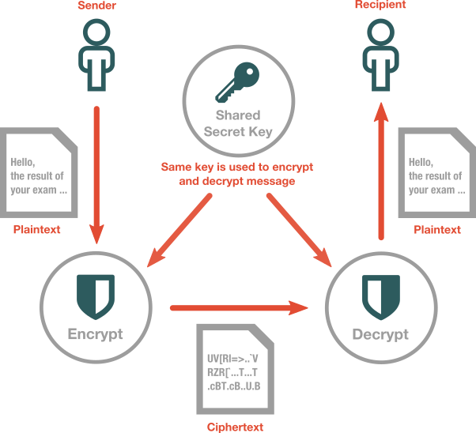

# Matematiikkaa kaikille: Salausmenetelmät

---
## Perusidea
* Tarve kommunikoida luottamuksellisesti
* Steganografia: viestien kätkeminen
* Kryptografia: viestien salakirjoittaminen
* Tehty käsityönä, mekaanisesti ja nykyisin tietokoneilla

???
* tarve luottamukselliseen kommunikointiin ollut kautta aikojen ja kulttuurien
* muinaiset roomalaiset, kreikkalaiset, intialaiset, arabit jne
* kätkeminen
  * päänahka
  * teksti
  * pikselit
---
## Klassiset menetelmät
* Atbash (aakkosten y-peilaus)
* Caesar (aakkosten siirto vakiolla)
* Sekoitettu Caesar (aakkosten permutaatio)
* Vigenère (Caesar avainsanalla)
* Beaufort (käännetty Vigenère)
* Vernamin menetelmä eli kerta-avain (one-time-pad: avaimena viestin pituinen satunnaisjono)
* Enigma
???
* frekvenssianalyysin löytämisen (keskiajalla) jälkeen klassinen salaus (caesarista enigmaan) menettänyt tehonsa
* Beaufort on kääntyvä eli salausoperaatio salatekstille tuottaa lähdetekstin
* Claude Shannon proved, using information theory considerations, that any theoretically unbreakable cipher must have keys which are at least as long as the plaintext, and used only once: one-time pad.
* https://en.wikipedia.org/wiki/Substitution_cipher
---
## Klassiset menetelmät
#### Esimerkki: Atbash
---
## Klassiset menetelmät
#### Esimerkki: Caesar

???
---
## Klassiset menetelmät
#### Esimerkki: variaatioita
* Vigenère
* Beaufort
* Gronsfeld
---
## Klassiset menetelmät
#### Esimerkki: Enigma
---
## Modernit menetelmät
* Automatisoidut menetelmät
* Jatkuva kilpajuoksu laskentatehoa vastaan
* Algoritmeja valtavasti eri tarkoituksia varten
* Käytetään esimerkiksi
  - salaukseen
  - allekirjoitamiseen
  - sisällön eheyden varmistamiseen
  - autentikointiin
* Tietokoneet, Internet, pankkimaailma, sotateknologia, tekijänoikeudet, ...
---
## Modernit menetelmät
#### Symmetriset menetelmät

---
## Modernit menetelmät
#### Symmetriset menetelmät
* Salaus ja purkaminen samalla avaimella
* Avain täytyy saada molemmille osapuolille
* Turvallisuus perustuu yhteisen avaimen pitämiseen salassa

* Analogia: A:lla ja B:llä yhteinen lukko ja kaksi avainta

???
* voidaan toteuttaa merkki tai lohko kerrallaan
* Esim. AES, DES, blowfish, twofish, ...
* Ongelmia:
  - miten saada avain kaikille osapuolille?
  - known-plaintext-attacks
  - chosen-plaintext-attacks
---
## Modernit menetelmät
#### Asymmetriset menetelmät
* Salaukseen ja purkamiseen käytetään eri avainta
* Usein yksityinen ja julkinen avain
* Salaista avainta ei jaeta kenellekään
* Yksityinen avain on vastaanottajalla => salaus
* Yksityinen avain on lähettäjällä => allekirjoitus
* Edellyttää luottamusta julkiseen avaimeen
* Algoritmit perustuvat johonkinlaskennallisesti vaativaan ongelmaana, yleensä
  - alkutekijähajotelmaan
  - diskreettiin logaritmiin tai
  - elliptisiin käyriin

???
* Esim Diffie-Hellman, RSA, ECC, PGP
---
## Modernit menetelmät
#### Asymmetriset menetelmät
* Analogia: A pyytää B:ltä avoimen lukon, lukitsee viestilaatikon B:n lukolla ja lähettää laatikon B:lle.
* Ongelma: kolmas osapuoli voi vaihtaa lukon omaansa heti alussa, ennen lukon päätymistä A:lle

---
## Modernit menetelmät
#### Hybridit
* Usein käytetään sekä symemtrisiä että epäsymmetrisiä menetelmiä
* Viesti salataan symmetrisesti ja avain välitetään epäsymmetrisesti (PGP, TLS)
* Parhaat puolet molemmista

---
## Modernit menetelmät
#### Analogia
* A:lla ja B:llä omat lukkonsa ja avaimensa. B lähettää A:lle avoimen lukon. A laittaa viestin laatikkoon, lukitsee laatikon omalla lukollaan ja lähettää B:lle. Lisäksi A laittaa avaimensa toiseen laatikkoon, lukitsee laatikon B:n lukolla, ja lähettää sen B:lle.
* toinen tapa:  A:lla ja B:llä omat lukkonsa ja avaimensa. A laittaa viestin laatikkoon, lukitsee ja lähettää B:lle. B lukitsee laatikon lisäksi omalla lukollaan ja lähettää takaisin A:lle. A poistaa oman lukkonsa ja lähettää laatikon B:lle.
---
#### Hyökkäyksiä
  * dictionary attack
  * man-in-the-middle
  * rainbow-table
  * brute-force
---

## Esimerkki: Diffie-Hellman

---
## Esimerkki: RSA

* Perustuu (suuriin) alkulukuihin $p$ ja $q$.
* Julkinen avain on pari $(N, e)$, missä $N = pq$ ja $e$ lukua $\lambda(n)$ pienempi, sen kanssa suhteellinen alkuluku.
* Salainen avain on sellainen luku $d$, jolle $ed\equiv 1 (mod (p-1)(q-1))$.
* Viesti $A$ salataan laskemalla $C \equiv A^e (mod N)$.
* Salattu viesti $C$ puretaan laskemalla $A \equiv C^d (mod N)$.

---
#### Esimerkki: Salasanat
  * https://en.wikipedia.org/wiki/Password_cracking#Incidents
  * http://www.lockdown.co.uk/?pg=combi
---

## Esimerkki: PGPcalc

???
## Tehtäviä

  * César: salaus ja purku
  * Vigenère: salaus ja purku (kääntymättömyys)
  * Beaufort: salaus ja purku (kääntyvyys)
  * Vanha tehtävä 5
  * Jokin DH-tehtävä
  * Jokin (osallistava?) RSA-tehtävä

## Ideoita

  * https://en.wikipedia.org/wiki/Trapdoor_function
  * https://en.wikipedia.org/wiki/One-way_function
  * https://en.wikipedia.org/wiki/Secret_sharing_using_the_Chinese_remainder_theorem
  * https://en.wikipedia.org/wiki/One-time_pad
  * https://fi.wikipedia.org/wiki/Enigma_(salauslaite)
