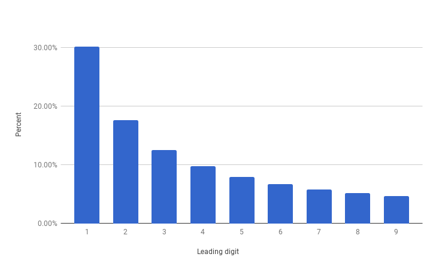

::: title
- HY / Avoin yliopisto
- Matematiikan ja tilastotieteen laitos
- Matematiikkaa kaikille (kesä 2017)
- Harjoitus 3
:::

::: teht
# Tehtävä

Ota pari ja valitse kaksi mustaa ja yksi punainen pelikortti.
Käännä kortit selkäpuoli ylöspäin, sekoita ne ja aseta riviin.
Parisi tavoitteena on saada punainen kortti. Hän valitsee pöydällä olevista
korteista yhden, mutta ei vielä käännä sitä ympäri.
Tarkista kaksi muuta korttia ja käännä ympäri yksi musta kortti.
Parisi saa päättää, vaihtaako valitsemansa kortin toiseen vai ei.

* Pelatkaa muutamia kierroksia ja kerätkää pieni aineisto siitä,
  päätettiinkö korttia vaihtaa ja tuliko voitto vai häviö.
  Pelatkaa niin monta kierrosta, että aineisto on mahdollisimman kattava.
* Kannattaako valittua korttia vaihtaa? Miten tämän voisi perustella?
:::

::: teht
# Tehtävä

Alla olevassa taulukossa on erään yliopiston sisäänpääsyprosentteja jaoteltuna
mies- ja naishakijoiden mukaan. Taulukon perustella useimpiin tiedekuntiin
on hyväksytty naishakijoista suurempi osuus kuin mieshakijoista.

<table class="wikitable" style="margin-left:auto; margin-right:auto; border:none;">
<tbody>
<tr>
<th></th>
<th colspan="2">Miehet</th>
<th colspan="2">Naiset</th>
</tr>
<tr>
<th>Tiedekunta</th>
<th>Hakijoita</th>
<th>Hyväksyttyjä</th>
<th>Hakijoita</th>
<th>Hyväksyttyjä</th>
</tr>
<tr>
<th>A</th>
<td>825</td>
<td>62%</td>
<td>108</td>
<td><b>82%</b></td>
</tr>
<tr>
<th>B</th>
<td>560</td>
<td>63%</td>
<td> 25</td>
<td><b>68%</b></td>
</tr>
<tr>
<th>C</th>
<td>325</td>
<td><b>37%</b></td>
<td>593</td>
<td>34%</td>
</tr>
<tr>
<th>D</th>
<td>417</td>
<td>33%</td>
<td>375</td>
<td><b>35%</b></td>
</tr>
<tr>
<th>E</th>
<td>191</td>
<td><b>28%</b></td>
<td>393</td>
<td>24%</td>
</tr>
<tr>
<th>F</th>
<td>373</td>
<td> 6%</td>
<td>341</td>
<td> <b>7%</b></td>
</tr>
</tbody></table>

Laadi seuraavanlainen yhteenveto koko aineistosta:

|  | Hakijoita| Hyväksyttyjä | Hyväksymisprosentti |
| -| - | - | - |
| Naisia |  |  | |
| Miehiä |  |  | |

Miltä tilanne näyttää yhteenvedon perusteella? Onko päätelmä todenmukainen?
:::

::: teht
# Tehtävä

Alla olevat kuvat esittävät kahden kuvitteellisen puolueen (siniset ja punaiset)
kannattajien sijoittumista kartalle kahtena eri vuonna.
Tehtävänäsi on kummassakin tapauksessa jakaa alue viiteen vaalipiiriin siten, että
kussakin piirissä on saman verran äänestäjiä ja

* sininen
* punainen

puolue voittaa, kun käytössä on enemmistövaalit. Miten vaalipiirit voisi muodostaa?
Vaalipiirin tulee olla yhtenäinen.

  
  

:::

::: teht
# Tehtävä

Tutkija on saanut käsiinsä seuraavat tilastoaineistot:

* maapallon etäisyys lähimpiin galakseihin
* Suomen kuntien väkiluvut
* tulivuorten purkausten voimakkuudet eräänä ajanjaksona
* yleisimmät pankkikorttien tunnusluvut
* suuri joukko Fibonaccin lukuja
* vaaliehdokkaiden äänimäärät äänestyspaikoittain
* suuren yrityksen tulo- ja menoerät eräänä ajanjaksona

Hän kiinnostuu aineistoissa esiintyvistä luvuista ja haluaa selvittää,
miten niiden ensimmäiset numerot mahtavat jakautua.

Miltä itse arvelisit kunkin jakauman likimain näyttävän? Yhdistä aineistot alla oleviin kuviin (klikkaa suuremmaksi).

  
  
  

:::

::: teht
# Tehtävä

Piirrä alla olevan kuvan mukainen *logaritminen asteikko*. Väritä tai erota muuten toisistaan
ne asteikon alueet, joilla sijaitsevien lukujen ensimmäinen numero on $1$, $2$, $3$, $4$, tai $5$.

Jos valitset satunnaisen luvun logaritmiselta asteikolta, millä todennäköisyydellä arvioisit
(kuviosi perusteella) sen ensimmäisen numeron olevan

* 1
* 2
* 3?

<!-- http://investexcel.net/wp-content/uploads/2012/10/Arizona.png -->
:::

::: teht
# Tehtävä

Henkilöt A ja B ovat hankkineet uudet solmiot, mutta unohtaneet niiden hinnat.
He aikovat lyödä vetoa siitä, kumpi sai solmionsa halvemmalla ja sopivat voittajan
saavan häviäjän solmion.

A järkeilee seuraavasti:
"On yhtä todennäköistä voittaa tai hävitä. Jos häviän, menetän solmioni, mutta
jos voitan, saan arvokkaamman solmion. Niinpä minun kannattaa pelata."

B järkeilee samalla tavalla ja aikoo myös osallistua peliin. Ei kuitenkaan
ole mahdollista, että peli olisi molemmille suotuisa. Missä järkeily menee pieleen?
:::

::: teht
# Tehtävä

Edessäsi on kolme laatikkoa, joista yhdessä on kaksi kultakolikkoa,
toisessa kaksi hopeakolikkoa ja kolmannessa yksi kumpaakin.
Valitset laatikon ja poimit sokkona kolikon, joka osoittautuu kultakolikoksi.
Millä todennäköisyydellä toinenkin laatikon kolikoista on kultaa?

:::

::: teht
# Tehtävä

Luokassa on

* 10
* 20
* 30

samana vuonna syntynyttä henkilöä. Laske todennäköisyys, heistä
ainakin kahdella on sama syntymäpäivä kun syntymäpäivien oletetaan jakautuneen
tasaisesti vuoden jokaiselle päivälle. Karkausvuoden mahdollisuutta ei tarvitse huomioida.
:::

::: teht
# Tehtävä

Osoita, että joukossa, jossa on

* 3
* 5
* $n$

henkilöä, on vähintään kaksi henkilöä, joilla on täsmälleen yhtä monta tuttavaa
tässä joukossa. Tuttavuus ymmärretään molemminpuoliseksi.
:::

::: teht
# Tehtävä

Lumikki ja seitsemän kääpiötä ovat lähdössä huviretkelle. He matkustavat
vaunuissa, jossa kaikki kahdeksan matkustajaa istuvat parijonossa, eli
pareittain peräkkäin.

* Kuinka monella tavalla seurue voi matkustaa?
* Kuinka monella tavalla seurue voi matkustaa, kun Lumikki ei halua istua
  Nuhanenän vieressä eivätkä Viisas ja Unelias tule toimeen keskenään?
* Jos järjestys valitaan arvalla, niin millä todennäköisyydellä kaikki ovat tyytyväisiä tulokseen?
:::

::: teht
# Tehtävä
Tarkastellaan lukujoukkoa $\left\{1,2,3\right\}$.
* Laske lukujen keskiarvo ja keskihajonta.
* Joukkoon lisätään reaaliluku $x$ siten, että keskihajonta säilyy samana. Selvitä $x$.

Voit käyttää keskihajonnalle kaavaa
$$
  \sigma = \sqrt{\frac{1}{N}\sum_{i=1}^Nx_i^2 - \left[\sum_{i=1}^Nx_i/N\right]^2}.
$$
:::

::: teht
# Tehtävä

Ohessa on taulukko neljästä eri tilanteesta, joissa kaikissa on kaksi muuttujaa $x$ ja $y$.
Laske kullekin tilanteelle muuttujien $x$ ja $y$ keskiarvot ja -hajonnat.
Miltä hajontakuviot mahtavat näyttää?

Jos käytät esimerkiksi taulukkolaskentaohjelmaa, niin laske lisäksi
muuttujien $x$ ja $y$ korrelaatiokertoimet kussakin otoksessa.

<table class="wikitable" style="text-align: center; margin-left:auto; margin-right:auto;">
<tbody><tr>
<th colspan="2">Data I</th>
<th colspan="2">Data II</th>
<th colspan="2">Data III</th>
<th colspan="2">Data IV</th>
</tr>
<tr>
<td>x</td>
<td>y</td>
<td>x</td>
<td>y</td>
<td>x</td>
<td>y</td>
<td>x</td>
<td>y</td>
</tr>
<tr>
<td>10.0</td>
<td>8.04</td>
<td>10.0</td>
<td>9.14</td>
<td>10.0</td>
<td>7.46</td>
<td>8.0</td>
<td>6.58</td>
</tr>
<tr>
<td>8.0</td>
<td>6.95</td>
<td>8.0</td>
<td>8.14</td>
<td>8.0</td>
<td>6.77</td>
<td>8.0</td>
<td>5.76</td>
</tr>
<tr>
<td>13.0</td>
<td>7.58</td>
<td>13.0</td>
<td>8.74</td>
<td>13.0</td>
<td>12.74</td>
<td>8.0</td>
<td>7.71</td>
</tr>
<tr>
<td>9.0</td>
<td>8.81</td>
<td>9.0</td>
<td>8.77</td>
<td>9.0</td>
<td>7.11</td>
<td>8.0</td>
<td>8.84</td>
</tr>
<tr>
<td>11.0</td>
<td>8.33</td>
<td>11.0</td>
<td>9.26</td>
<td>11.0</td>
<td>7.81</td>
<td>8.0</td>
<td>8.47</td>
</tr>
<tr>
<td>14.0</td>
<td>9.96</td>
<td>14.0</td>
<td>8.10</td>
<td>14.0</td>
<td>8.84</td>
<td>8.0</td>
<td>7.04</td>
</tr>
<tr>
<td>6.0</td>
<td>7.24</td>
<td>6.0</td>
<td>6.13</td>
<td>6.0</td>
<td>6.08</td>
<td>8.0</td>
<td>5.25</td>
</tr>
<tr>
<td>4.0</td>
<td>4.26</td>
<td>4.0</td>
<td>3.10</td>
<td>4.0</td>
<td>5.39</td>
<td>19.0</td>
<td>12.50</td>
</tr>
<tr>
<td>12.0</td>
<td>10.84</td>
<td>12.0</td>
<td>9.13</td>
<td>12.0</td>
<td>8.15</td>
<td>8.0</td>
<td>5.56</td>
</tr>
<tr>
<td>7.0</td>
<td>4.82</td>
<td>7.0</td>
<td>7.26</td>
<td>7.0</td>
<td>6.42</td>
<td>8.0</td>
<td>7.91</td>
</tr>
<tr>
<td>5.0</td>
<td>5.68</td>
<td>5.0</td>
<td>4.74</td>
<td>5.0</td>
<td>5.73</td>
<td>8.0</td>
<td>6.89</td>
</tr>
</tbody></table>

Katso lopuksi [hajontakuviot](assets/img/quartet.png).
:::
